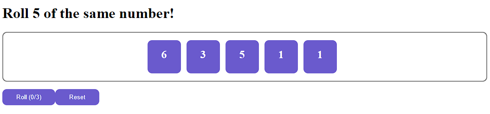
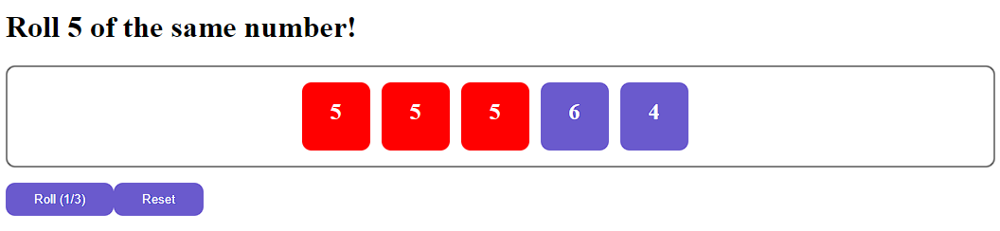
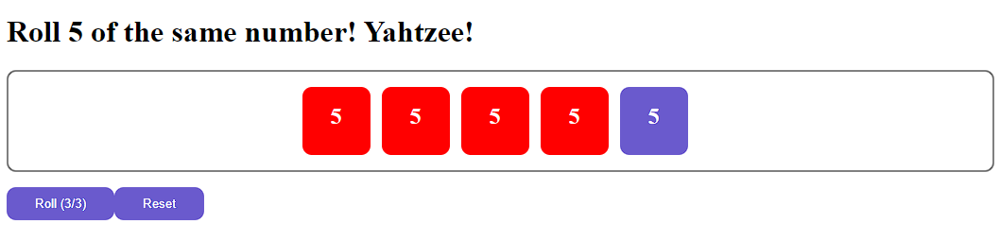

<h1>Yahtzee Dice Roller</h1>

 This is a simple application using react that allows you to roll 5 dice. If all 5 dice show the same value, you win! 

<h2>Features</h2>
<ul>
  <li>Roll up to 5 dice simultaneously</li>
  <li>Ability to click on each die to hold and stop it from being rerolled</li>
  <li>The Roll button allows you to roll up to 3 times just like in Yahtzee</li>
  <li>The Reset button will reset the held dice and roll counter for the next player</li>
  <li>If all dice have the same value "Yahtzee!" is displayed</li>
</ul>

  \
  \
  

